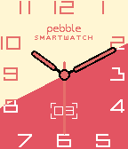
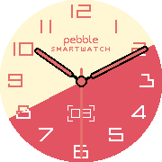
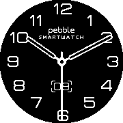

# Pebble-Mercury


A watchface for the Pebble Smartwatch.

Inspired by the Hermes watchface for the Apple Watch.

This watchface was made for the
[Rebble Hackathon #002](https://rebble.io/hackathon-002/).

## Screenshots

| Aplite                                 | Basalt                                 | Chalk                                   | Diorite                                  |
| -------------------------------------  | -------------------------------------  | --------------------------------------- | ---------------------------------------  |
|   |   |      |   |
|  |  |     |  |
|  |  |     |  |

## Installing

[Get it from the Rebble Store](https://apps.rebble.io/en_US/application/67cdf003b7a023034a3395bc).

## Dependencies

* Pebble SDK
* pebble-clay

## Building & Installing from Source

### Encoding the Resources

The watchface reads the assets encoded in binary, so in order to build it you
first need to encode everything located under `img/resources/*.png` into
`resources/*.bin`. There's an utility included for that under
`ImageEncoder/ImageEncoder.py` and a shell script `EncodeImages.sh` that calls
that script for every needed asset. That way, to encode the images you can just
do

```
python -m pip install ImageEncoder/requirements.txt
./EncodeImages.sh
```

### Building

```
pebble build
```

### Installing

#### Pebble SDK Emulator

```
pebble install --emulator [PLATFORM]
```

#### Phone/Watch

```
pebble install --phone [PHONE_IP_ADDRESS]
```

## Acknowledgements

This watchface was inspired by the Hermes watchface for the Apple Watch.

Fonts provided by [NiVZ](https://apps.rebble.io/en_US/developer/549f60677c5f0ee803000014/1).

## License

Copyright (C) 2025 Javier Rizzo-Aguirre

This program is free software: you can redistribute it and/or modify
it under the terms of the GNU General Public License as published by
the Free Software Foundation, either version 3 of the License, or
(at your option) any later version.

This program is distributed in the hope that it will be useful,
but WITHOUT ANY WARRANTY; without even the implied warranty of
MERCHANTABILITY or FITNESS FOR A PARTICULAR PURPOSE.  See the
GNU General Public License for more details.

You should have received a copy of the GNU General Public License
along with this program.  If not, see <https://www.gnu.org/licenses/>.
